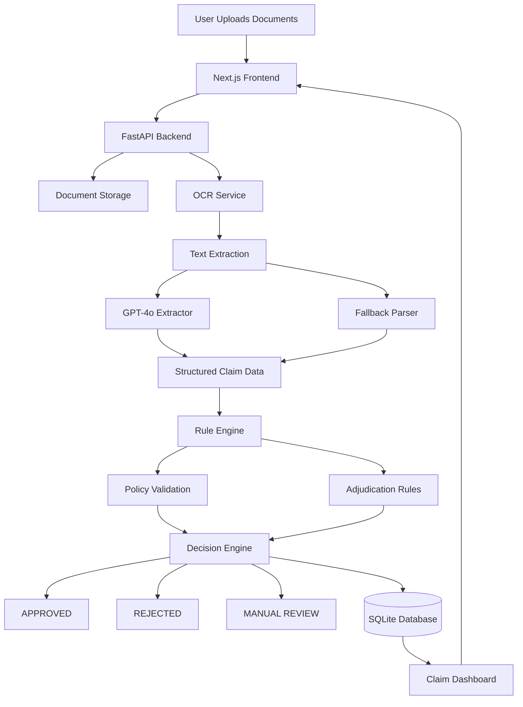
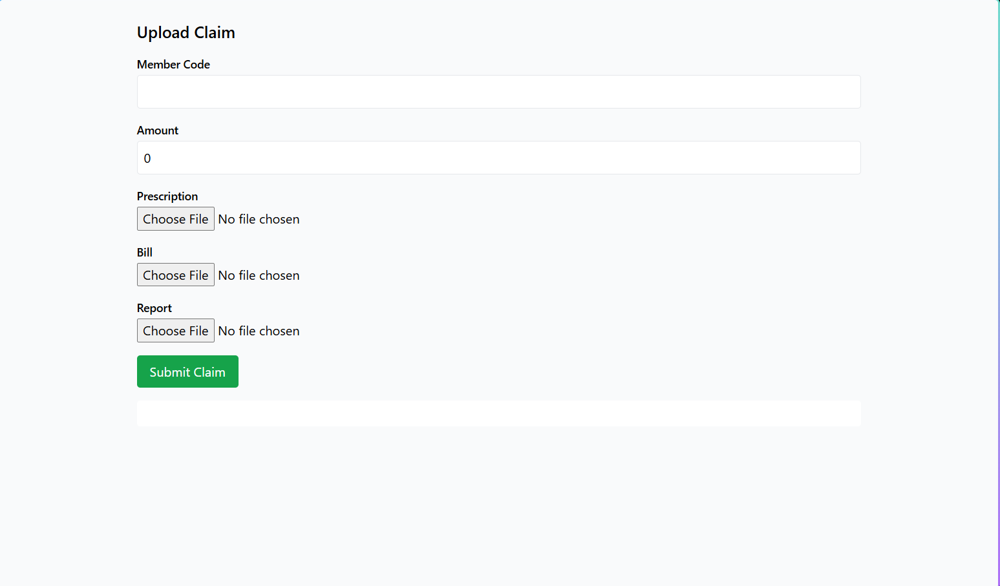
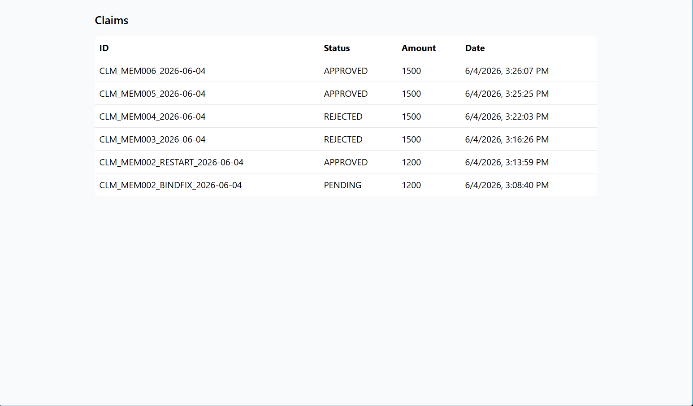
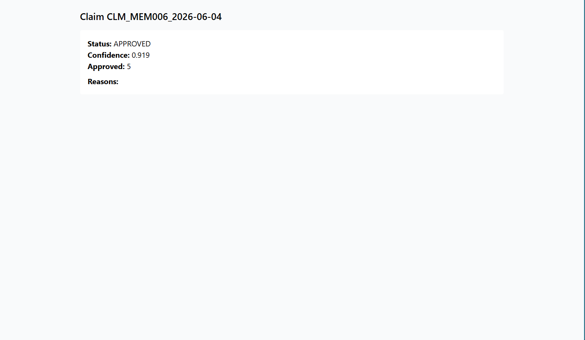

# Plum OPD Claim Adjudication — README (Finalized)

## Project Overview

This repository contains an end-to-end Minimum Viable Product (MVP) for automated OPD claim adjudication. It includes a FastAPI backend that ingests uploaded documents, an extraction layer (OCR + optional LLM extractor), a rules-based adjudication engine, and a Next.js frontend that exercises the full upload → process → decision flow.

Goals:
- Demonstrate automated claim extraction and adjudication
- Provide deterministic behavior for offline smoke tests (no OpenAI key required)
- Produce clear artifacts and documentation for evaluation

## Problem Statement

Given medical documents (bills, prescriptions, reports), extract structured data, evaluate claims against policy terms and adjudication rules, and produce an explainable decision (APPROVED / REJECTED) with approved amount, confidence score, and reasons.

## Architecture Diagram




## Technology Stack

- Frontend: Next.js 14, React 18, TypeScript, Tailwind CSS
- Backend: Python 3.10, FastAPI, Uvicorn
- Persistence: SQLite (SQLAlchemy)
- Extraction: `tesseract` CLI (OCR), OpenAI Responses API (optional)
- Testing: custom `tests_runner.py` that evaluates `test_cases.json`

## System Workflow

1. User creates a claim and uploads supporting documents via `/upload` UI.
2. Backend saves files to `./data/uploads` and stores Claim/Document records.
3. On process request, backend runs OCR (if needed) and attempts LLM extraction. If LLM is unavailable, deterministic fallback extractor is used.
4. Extracted fields feed into the Rule Engine which evaluates policy terms and outputs a decision JSON with status, approved_amount, confidence_score, reasons, and policy_rules_checked.
5. Frontend displays decisions at `/claims` and `/claims/{id}`.

## Setup Instructions (Local)

Prereqs:
- Python 3.10
- Node.js 18+
- `tesseract` (optional for image OCR)

Backend (Windows example):

```powershell
cd backend
python -m venv .venv
.\.venv\Scripts\Activate.ps1
pip install -r requirements.txt
set OPENAI_API_KEY=  # optional
uvicorn app.main:app --reload --port 8000
```

Frontend:

```bash
cd frontend
npm install
npm run dev
# or build: npm run build && npm run start
```

Environment:
- `NEXT_PUBLIC_API_BASE_URL` defaults to `http://127.0.0.1:8000` for direct backend calls (used to avoid multipart proxy issues during dev).

## API Endpoints (summary)

- `GET /api/health` — health check
- `POST /api/claims` — create claim (body: `ClaimCreate` with `items` list)
- `POST /api/claims/{claim_id}/upload` — multipart file upload (`file`, `doc_type`)
- `POST /api/claims/{claim_id}/process` — run extraction + rule engine
- `GET /api/claims/` — list claims
- `GET /api/claims/{claim_id}` — fetch claim + decision

Refer to the backend FastAPI OpenAPI docs at `/docs` when running locally for full request/response schemas.

## Running `test_cases.json`

The repository includes `test_cases.json` and a runner that evaluates the rule engine deterministically (bypasses LLM):

```bash
$env:PYTHONPATH="backend"
python -m app.tests_runner
```

## Test Validation

The adjudication engine was validated against the provided `test_cases.json`.

Results:

| Metric           | Value |
| ---------------- | ----- |
| Total Test Cases | 10    |
| Passed           | 10    |
| Failed           | 0     |
| Accuracy         | 100%  |

Coverage includes:

* Standard OPD consultations
* Missing documents
* Waiting period validation
* Excluded treatments
* Pre-authorization checks
* Network hospital claims
* Fraud/manual review scenarios
* Alternative medicine coverage


Output:

```
Overall Accuracy: 10/10 (100.0%)
```


Save the runner output for review (we keep `artifacts/test_results.txt`).


## Screenshots

The following screenshots demonstrate the complete end-to-end claim adjudication workflow implemented in this project.

### Upload Claim

Users can create a new OPD claim by providing member details and uploading supporting medical documents such as prescriptions, bills, and diagnostic reports.



---

### Claims Dashboard

The claims dashboard provides a consolidated view of all submitted claims along with their current adjudication status, claim amount, and submission timestamp.



---

### Claim Details

The claim details page displays the adjudication outcome, confidence score, approved amount, decision reasons, and policy checks applied during evaluation.




## Deployment Instructions

These steps produce a production-ready deployment split between a hosted backend and static frontend.

Backend (Railway or Render):

Railway (quick):
1. Create a new project and link your GitHub repo.
2. Set environment variables: `OPENAI_API_KEY` (optional), `DATABASE_URL` (use managed Postgres if replacing SQLite).
3. Set build command: `pip install -r requirements.txt` and start command: `uvicorn app.main:app --host 0.0.0.0 --port $PORT`.

Render (Docker-free):
1. New Web Service -> Connect repo -> Select `backend/` as the root.
2. Build command: `pip install -r requirements.txt` ; Start command: `uvicorn app.main:app --host 0.0.0.0 --port $PORT`.
3. Add env vars as above.

Frontend (Vercel):
1. Import repo into Vercel; set the root to `frontend`.
2. Build command: `npm run build`; Output directory: `.next` (Vercel auto-detects Next.js).
3. Set env var `NEXT_PUBLIC_API_BASE_URL` to the backend URL.

Notes:
- For production, migrate from SQLite to a managed RDBMS and update database config.
- Store uploaded documents on cloud storage (S3/GCS) instead of local disk.

## Assumptions

Key assumptions used in this implementation include:

* Claims must contain a valid member identifier.
* OCR text quality is sufficient for information extraction.
* GPT-4o extraction is optional; a deterministic fallback extractor is available.
* SQLite is used for development and PostgreSQL is recommended for production.
* Uploaded files are stored locally for the MVP and should be moved to cloud storage in production.

For the complete list, see `assumptions.md`.


## Future Improvements

- Replace fallback parsers with fine-tuned extractor models for higher accuracy
- Add authentication + RBAC for claim submission and manual review
- Add background job queue (Celery/RQ) for document processing and retries
- Add full CI with automated smoke tests and demo video generation

## Support

If anything fails during local setup, run the backend tests and `scripts/verify_endpoints.py` to reproduce the end-to-end flow and gather logs.

---

## Submission Highlights

* End-to-end OPD claim adjudication workflow
* OCR-based document processing
* GPT-4o integration with deterministic fallback extraction
* Dynamic policy evaluation using policy_terms.json
* Rule-driven adjudication engine
* APPROVED / REJECTED / MANUAL_REVIEW decisions
* Explainable reasoning for every decision
* 100% accuracy on provided test_cases.json
* FastAPI backend + Next.js frontend
* Deployment-ready architecture


Next steps (performed in this run): created `demo_script.md`, `architecture.md`, and `artifacts/` files with examples and test outputs (not committed). See repository root for the new files.

