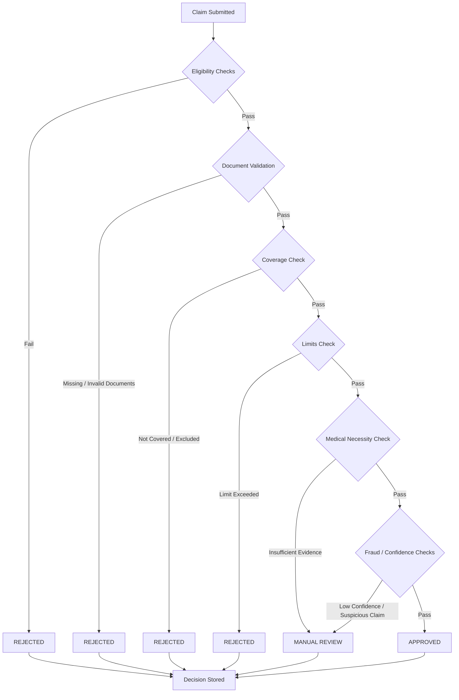

Decision Flowchart — High-level

This flowchart summarizes the decision-making pipeline used by the adjudication engine.

Decision output includes: `status`, `approved_amount`, `confidence_score`, `reasons`, and `policy_rules_checked`.
